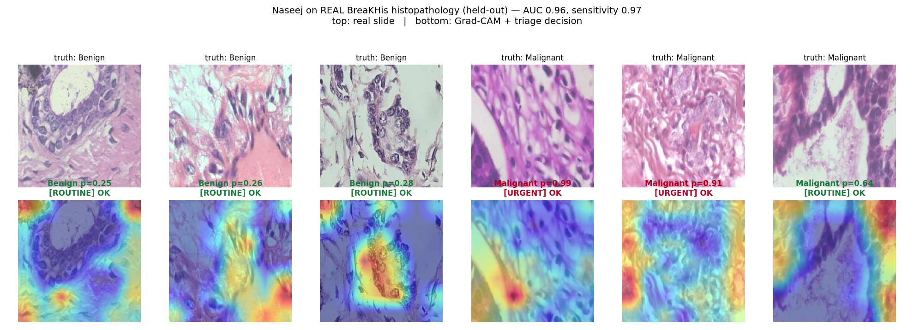

# نسيج · Naseej — AI Pathology Triage

**AI pathology triage for the labs that can't afford the scanner.**

Naseej is a software-only AI system that analyses a biopsy slide image — including
a photo taken through an ordinary microscope with a phone — and flags suspicious
tissue, assigning each case a **triage priority** so the likely-malignant slides
reach a pathologist first. It is built for the reality of Jordanian and MENA
labs, where the expensive whole-slide scanners that commercial pathology-AI
requires simply do not exist.

> **Decision support, not diagnosis.** Naseej re-orders the queue and highlights
> regions of interest. The pathologist always makes the final call.

---

## 1. The problem

Cancer is diagnosed late in Jordan, and late diagnosis is what kills.

- Cancer is a leading cause of death in Jordan (~15% of all deaths), and incidence
  rose over 60% in 13 years.
- About **two-thirds of breast cancer patients in Jordan present at an advanced
  stage**, after the disease has already spread.
- Early, localised breast cancer has a **5-year survival above 99%** — yet Jordan's
  overall breast-cancer survival has historically sat near **59%**. The gap is
  largely *how late it is found*.
- Every diagnosis runs through a biopsy and a pathologist — but **only ~10% of
  Jordanian pathologists use digital pathology** in routine work, and **funding is
  the number-one barrier** to adopting the AI tools that could speed it up.

The bottleneck is the pathologist: too few of them, and a manual, first-in-first-out
workflow that buries the urgent malignant cases behind a pile of benign ones
(70–80% of biopsies turn out benign).

## 2. Why existing solutions don't reach here

State-of-the-art pathology AI (Paige, PathAI, Ibex) is excellent — and locked
behind a **whole-slide scanner that costs USD 50,000–300,000+**, plus IT, storage,
and training. That is exactly why most Jordanian labs are not digitised. The
budget players still sell a *scanner*. **Naseej eliminates the scanner.**

| | Commercial pathology AI | **Naseej** |
|---|---|---|
| Hardware required | $50k–300k whole-slide scanner | A phone + the microscope the lab already owns |
| Input | Pristine whole-slide image | Phone photo through the eyepiece |
| Market | Western, scanner-equipped labs | Labs the giants will never sell to |
| Our claim | More accurate | More *reachable* — good-enough triage that actually runs here |

We are honest about this: we are not trying to out-accuracy Paige. We make
computational pathology *possible* where it is currently impossible.

## 3. What Naseej does

1. Takes a biopsy slide image (scanner output **or** a phone photo).
2. Runs a fine-tuned CNN to estimate the probability of malignancy.
3. Produces a **Grad-CAM heatmap** showing the tissue regions that drove the call
   (explainability the pathologist can audit).
4. Assigns a **triage priority**: `URGENT` → `REVIEW` → `ROUTINE`, re-ordering the
   queue so dangerous cases surface first.

## 4. AI / technical approach

- **Paradigm:** supervised binary image classification (benign vs malignant) on
  histopathology, with a triage layer on top of the probability.
- **Model:** transfer learning from an ImageNet-pretrained CNN (ResNet-50 by
  default; ResNet-18 / EfficientNet-B0 selectable), with a new 2-class head,
  fine-tuned on histopathology.
- **Recall-prioritised training:** the loss weights the malignant class higher
  (a missed cancer is far costlier than a false alarm), pushing the model toward
  high sensitivity.
- **Phone-capture robustness *(our contribution)*:** training augmentations
  simulate real phone-through-microscope conditions — variable lighting, blur,
  rotation, colour shift — so the model holds up on messy phone images rather than
  only clean scanner output. This is the key difference from scanner-only tools.
- **Explainability:** a from-scratch Grad-CAM implementation (`src/gradcam.py`).
- **Upgrade path:** swap the backbone for an open pathology foundation model
  (CTransPath, Phikon, UNI) for state-of-the-art features with little extra data
  — `build_foundation_model` in `src/model.py` is a real, optional `timm`-based
  loader (set `config.FOUNDATION_MODEL`); Grad-CAM finds the target layer
  automatically.

**This is not an API wrapper.** The proprietary work is the fine-tuning, the
phone-robustness pipeline, and the triage logic — all in this repo.

## 5. System architecture

```
 Slide image (scanner OR phone photo)
        │
        ▼
 Preprocess + normalise  (src/data.py)
        │
        ▼
 Fine-tuned CNN backbone  (src/model.py)
        │
        ├──► P(malignant) ──► Triage priority  (src/inference.py)
        │
        └──► Grad-CAM heatmap  (src/gradcam.py)
        │
        ▼
 Result + heatmap + priority  →  Web demo (app/app.py)
```

## 6. Project structure

```
naseej/
├── README.md            ← this file
├── MODEL_CARD.md        ← intended use, data, metrics, limitations, ethics
├── Dockerfile           ← containerised demo
├── requirements.txt
├── Makefile             ← one-command workflows (make train / eval / test / ...)
├── config.py            ← all tunable settings
├── src/
│   ├── model.py         ← backbone + classification head (+ foundation-model loader)
│   ├── data.py          ← data loading + phone-capture augmentations
│   ├── gradcam.py       ← Grad-CAM (explainability)
│   ├── inference.py     ← predict + triage priority + heatmap (+ TTA, calibrated thresholds)
│   ├── triage.py        ← batch triage queue → prioritised worklist (CLI)
│   ├── train.py         ← training (recall-prioritised, two-phase, early stop)
│   ├── evaluate.py      ← sensitivity / specificity / AUC / confusion matrix + triage bands
│   ├── calibrate.py     ← data-driven thresholds (sensitivity floor; robust mode)
│   ├── temperature.py   ← temperature scaling (probability calibration)
│   ├── phone_sim.py     ← deterministic phone-capture degradation (for evaluation)
│   ├── robustness.py    ← benchmark: triage vs phone-capture degradation
│   ├── quality.py       ← reject unusable captures (blank/blurry) before classifying
│   └── report.py        ← bilingual (Arabic / English) triage reports
├── app/
│   ├── app.py           ← Gradio demo (single slide + triage-queue tabs)
│   └── api.py           ← REST API (FastAPI) for lab-workflow integration
├── scripts/
│   ├── get_data.py      ← dataset layout helper
│   ├── download_pcam.py ← automated public-dataset download (PatchCamelyon)
│   ├── make_demo_data.py ← synthetic fixture so the pipeline runs with no downloads
│   ├── make_samples.py  ← bundle sample slides for the booth UI
│   └── demo.py          ← one-command booth bootstrap (data→train→app)
├── assets/samples/      ← ready-to-click sample slides for the demo
├── tests/               ← CPU tests (no dataset / no downloads)
└── .github/workflows/   ← CI (tests + synthetic end-to-end on every push)
```

## 7. Setup

```bash
git clone https://github.com/kurdim12/naseej.git
cd naseej
python -m venv .venv && source .venv/bin/activate     # optional
pip install -r requirements.txt
```

### One-command demo (no dataset needed)

From a fresh clone to a running booth demo — generates a realistic synthetic
dataset, trains + calibrates a quick model, bundles sample slides, and launches
the web app:

```bash
make demo            # or: python -m scripts.demo
```

Re-running reuses what's already there. The app's **Single slide** tab has
click-to-load samples (including a blank frame that shows the quality gate
rejecting an unusable capture), and a **Triage queue** tab that sorts a batch
into a worklist. *(Synthetic data → believable-but-meaningless metrics; real
data gives real results.)*

## 8. Get the data

Anchor dataset: **BreaKHis** (breast histopathology, benign vs malignant).

**Fastest path — real data, one command (no account):** download a real
BreaKHis **400X** subset (~1,700 genuine `SOB_*` PNGs, real ~1:2 class
imbalance), mirrored on a public GitHub repo, straight into the layout below.
This is the exact data behind the [Results](#12-results):

```bash
python -m scripts.get_breakhis        # -> data/train/{Benign,Malignant}/*.png
python -m scripts.get_data            # verify the layout
```

For the **full** multi-magnification BreaKHis (~7,900 images), request access
from the official source linked in `scripts/get_data.py` and arrange as:

```
data/train/Benign/*.png
data/train/Malignant/*.png
```

**Another no-account option:** PatchCamelyon via torchvision —

```bash
python -m scripts.download_pcam --per-class 1500   # quick start
python -m scripts.download_pcam --full             # everything (large)
```

(Alternatives: BreaKHis as above, LC25000 — also public.)

### Try the whole pipeline with zero downloads

No dataset yet? Generate a tiny **synthetic** fixture (not real histopathology —
a sanity signal only) and run the full chain in seconds, on CPU:

```bash
python -m scripts.make_demo_data            # writes data/train/{Benign,Malignant}
python -m src.train --no-pretrained --epochs 2
python -m src.evaluate
python -m src.calibrate
python -m src.triage data/train --csv outputs/worklist.csv
```

## 9. Train

```bash
python -m src.train                          # ResNet-50, ImageNet weights
python -m src.train --backbone resnet18 --epochs 20 --lr 1e-4
python -m src.train --no-pretrained          # random init (offline)
```

Two-phase fine-tuning (head warm-up → full network), early stopping on
validation AUC, mixed precision on CUDA. Saves the best checkpoint (by AUC) to
`checkpoints/best_model.pt`, plus `outputs/history.json` and `train_summary.json`.

## 10. Evaluate & calibrate

```bash
python -m src.evaluate                        # metrics + triage-band breakdown
python -m src.calibrate                        # data-driven thresholds
python -m src.calibrate --target-sensitivity 0.98
```

`evaluate` reports **sensitivity (recall)** — the headline metric for a triage
tool — plus specificity, AUC, accuracy, the confusion matrix, and how the
triage bands bucket the validation set (it writes `outputs/metrics.json`).

`calibrate` is the operating-point step a real deployment needs. It picks the
`REVIEW` cut-off as the **highest threshold that still guarantees a target
malignant recall** (default 95%), and `URGENT` at the most-separating point
(Youden's J). Results are written to `outputs/thresholds.json` and picked up
automatically by inference, the triage CLI, the API, and the demo — so the
thresholds in `config.py` stop being guesses and start being measured.

### Measure phone-capture robustness

The project's central claim — *it works on phone photos, not just clean scans* —
is something to **measure, not assert**. This benchmark re-scores the validation
set under increasing, controlled phone-capture degradation (lighting, blur, JPEG,
rotation, colour cast) and reports how the triage-critical metrics — above all
the malignant recall still captured at the `REVIEW` threshold — hold up:

```bash
python -m src.robustness --severities 0,0.25,0.5,0.75,1.0
```

Writes `outputs/robustness.json` and a degradation curve to `outputs/robustness.png`.
A sharp drop in recall@REVIEW as severity rises is a sign the calibrated
threshold is too brittle for field conditions — exactly the kind of finding this
tool is meant to surface before deployment.

**Two fixes for that brittleness, both built in:**

- **Temperature scaling** (`src/temperature.py`): training automatically fits a
  scalar `T` on the validation set (Guo et al. 2017) and stores it in the
  checkpoint. It corrects over/under-confidence so probabilities mean what they
  say — without changing predictions (accuracy/AUC are untouched). Inference,
  evaluation, calibration, and triage all apply it transparently.
- **Robustness-aware calibration**: calibrate the thresholds *under* simulated
  phone degradation so the sensitivity floor holds in the field, not just on
  clean scans:

  ```bash
  python -m src.calibrate --target-sensitivity 0.95 --robust 0.5
  ```

## 11. Run the demo

```bash
python -m app.app
```

Open the printed local URL. Two tabs:
- **Single slide** — upload one image (or a phone photo of one) and see the
  label, confidence, triage badge, and Grad-CAM heatmap, live.
- **Triage queue** — upload many slides and get a prioritised worklist back,
  most-urgent first.

### Triage a whole queue (CLI)

The product is re-ordering the queue. Point Naseej at a folder of slides and get
a sorted worklist (URGENT → ROUTINE), written to CSV:

```bash
python -m src.triage path/to/folder --csv outputs/worklist.csv --save-overlays
python -m src.triage path/to/one_slide.png          # single slide
python -m src.triage path/to/one_slide.png --report bilingual   # Arabic + English
```

### Bilingual reports (Arabic / English)

For MENA-lab workflows, a single slide's triage result can be rendered as a
clean report in Arabic, English, or both — every report repeats, in both
languages, that this is decision support and the pathologist decides. Use
`--report {en,ar,bilingual}` on the CLI above, or `src.report.render_html` to
embed a report in a UI.

### Robustness for real captures

Three safeguards aimed at the realities of phone-through-microscope use:

- **Quality gate** (`src/quality.py`): a fast tissue-fraction + focus check
  rejects blank/background/blurry frames *before* classification, so the system
  asks for a re-capture instead of emitting a confident call on an unusable
  image. `python -m src.triage slide.png --check-quality`.
- **Uncertainty / abstention**: when `P(malignant)` lands within
  `UNCERTAIN_MARGIN` of 0.5 the case is flagged `uncertain` and never allowed to
  fall to `ROUTINE` — it's bumped to `REVIEW` so a human looks. A guess is
  surfaced as a guess, not a verdict.
- **Batched inference** (`src/inference.predict_batch`): queue triage runs in
  batched forward passes (numerically identical to per-image, materially faster
  on GPU/large images). The triage CLI uses it automatically when overlays
  aren't requested.

### Multi-class grading (subtypes)

Naseej is binary (benign vs malignant) by default, but also grades **tumour
subtypes** while still producing a benign/malignant triage decision. Just lay
the data out with one folder per subtype — Naseej auto-detects the classes,
treats subtypes whose names look malignant (`*carcinoma*`, `malign*`, …) as
malignant, and sets `P(malignant)` to the summed probability over the malignant
subtypes, so triage, calibration and robustness all work unchanged:

```
data/train/adenosis/*.png            # benign subtype
data/train/ductal_carcinoma/*.png    # malignant subtype
data/train/fibroadenoma/*.png        # benign subtype
data/train/lobular_carcinoma/*.png   # malignant subtype
```

```bash
python -m scripts.make_demo_data --multiclass   # 4-subtype synthetic fixture
python -m src.train --no-pretrained --epochs 5
python -m src.evaluate                            # binary triage metrics + a
                                                  # per-subtype confusion matrix
```

For full control over which subtypes count as malignant, call
`config.use_multiclass(class_names, malignant_classes)` before training (a
ready-made `BREAKHIS_8CLASS` preset is in `config.py`). A prediction then reports
the specific subtype (e.g. *lobular carcinoma*) and rolls it up to the triage
priority; bilingual reports show both.

### REST API (lab-workflow integration)

A LIS or lab system can POST images and get structured triage JSON back — no UI:

```bash
pip install fastapi "uvicorn[standard]" python-multipart
uvicorn app.api:app --port 8000           # interactive docs at /docs
```

- `GET /health` — liveness + whether a trained model is loaded.
- `POST /predict` — one image (`file`) → `{label, prob_malignant, priority, …}`.
- `POST /triage` — many images (`files`) → worklist sorted most-urgent-first.

### Run with Docker

```bash
docker build -t naseej .
docker run -p 7860:7860 \
  -v "$PWD/checkpoints:/app/checkpoints" \   # mount a trained checkpoint
  naseej
```

### One-command workflows (Makefile)

```bash
make demo-data        # synthetic fixture
make train            # train (override: make train ARGS="--backbone resnet18")
make eval calibrate   # evaluate then calibrate thresholds
make test             # run the CPU test suite
make app              # launch the Gradio demo
make api              # launch the REST API
```

## 12. Results

**Real data — BreaKHis (400X), 1,693 images, held-out validation split (338 images).**
ResNet-18 trained from scratch (ImageNet weights unavailable in our environment;
transfer learning would likely do better). Lead with sensitivity.

| Metric | Value (real BreaKHis) |
|---|---|
| **Sensitivity (recall)** | **0.973** |
| Specificity | 0.730 |
| AUC | 0.959 |
| Accuracy | 0.891 |
| Malignant recall @ calibrated REVIEW | 0.973 |

After threshold calibration (95% sensitivity floor), the `REVIEW` cut-off
reaches **sensitivity 0.95 at specificity 0.87** — a strong triage operating
point. The recall-prioritised design does exactly its job: it catches 217 of 223
malignant cases on the held-out set, trading specificity to avoid missing
cancers.

**Phone-capture robustness (real data).** As simulated capture quality drops
(`src/robustness.py`), AUC declines *gracefully* rather than collapsing, and the
calibrated threshold keeps malignant recall high — evidence for the project's
central claim that it survives messy phone images:

| Degradation severity | 0.00 | 0.25 | 0.50 | 0.75 | 1.00 |
|---|---|---|---|---|---|
| AUC | 0.959 | 0.947 | 0.931 | 0.883 | 0.795 |
| Malignant recall @ REVIEW | 0.951 | 0.942 | 0.964 | 0.964 | 0.978 |



(Also: `assets/results/robustness.png`, `assets/results/confusion_matrix.png`.)

> **Caveats (honest framing).** This is the 400X BreaKHis subset only, a single
> seeded split, trained from scratch on CPU — not a multi-magnification,
> cross-validated, or externally-validated result, and **not validated on
> Jordanian samples or real phone photos** (the robustness numbers use a
> *simulated* degradation of scanner images). It is a credible proof the pipeline
> learns real histopathology, not a clinical claim. Reproduce:

```bash
python -m scripts.get_breakhis          # downloads the real 400X subset
python -m src.train --no-pretrained --backbone resnet18 --epochs 15 --batch-size 32
python -m src.evaluate && python -m src.calibrate --target-sensitivity 0.95
python -m src.robustness
```

To reproduce the synthetic believable-but-meaningless illustration instead
(no download), use `scripts.make_demo_data --difficulty realistic` then train.

See [`MODEL_CARD.md`](MODEL_CARD.md) for intended use, training data, metrics,
limitations, and ethics in one place.

### Tests

CPU smoke tests run without any dataset or downloads (and in CI on every push):

```bash
python -m pytest tests/ -q
```

## 13. Limitations & honest framing

- **Decision support, not a diagnostic device.** The pathologist signs off.
- **Not yet validated on Jordanian samples.** Trained on public (largely Western)
  data; domain shift to local staining and phone cameras is a real risk. Jordanian
  field validation is the explicit next step (see roadmap).
- **Phone images are harder** than scanner whole-slide images; the augmentation
  pipeline mitigates but does not eliminate this.
- Thresholds in `config.py` should be **re-calibrated on local data** before any
  real use.

## 14. Roadmap

1. Field validation on a small set of real Jordanian biopsy images (with a partner lab).
2. Swap to an open pathology foundation model (CTransPath / Phikon / UNI) — *loader built (`src/model.py`).*
3. ~~Multi-class grading beyond binary benign/malignant.~~ ✅ **Done** — see "Multi-class grading" below.
4. ~~Arabic-language reporting~~ ✅ and a lab-workflow integration ✅ (`src/report.py`, `app/api.py`).

## 15. Ethics

No patient-identifiable data is used in this repository. Any future use of real
patient samples requires institutional review and informed consent. Naseej is a
research prototype and is **not** a medical device.

## 16. Acknowledgements

Built on PyTorch and torchvision. Public datasets: BreaKHis, PatchCamelyon,
LC25000. Open pathology foundation models referenced: CTransPath, Phikon, UNI.

## License

MIT — see [LICENSE](LICENSE).
